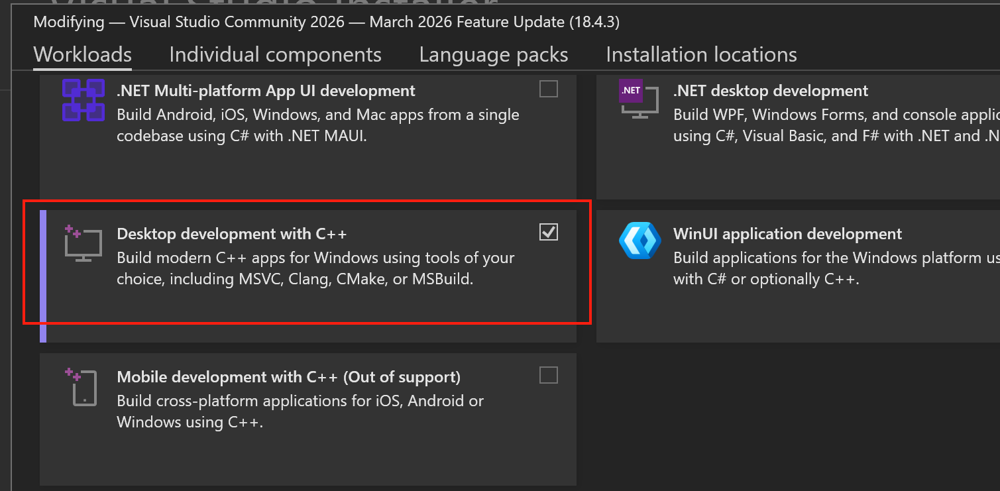

# 安装 d2l package

前提:

1) 准备 Python 3.11 或 Python 3.12

2) 安装 Windows Visual Studio Installer, 使用 Windows Visual Studio Installer 安装 Visual Studio Community 2026, 选择（）



然后，执行

```
pip install d2l-1.0.3-fix.tar.gz
```

在 Jupyter Notebook 中打开 linear-regression-scratch.ipynb